**ASM_COMMENT:**

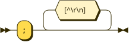

```
ASM_COMMENT
         ::= ';' [^\r\n]*
```

referenced by:

* AsmCodeLine

**IDENT:**

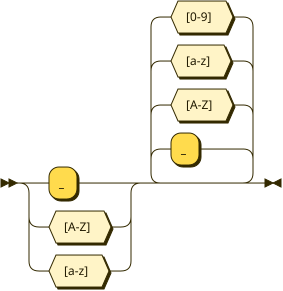

```
IDENT    ::= [_A-Za-z] [_A-Za-z0-9]*
```

referenced by:

* AsmCodeLine
* AsmDirective
* Declaration
* FunctionDefinition
* GlobalDeclaration
* Instruction
* ParameterList
* Primary

**NUMBER:**

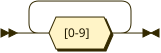

```
NUMBER   ::= [0-9]+
```

referenced by:

* Instruction
* Primary

**Program:**

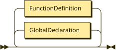

```
Program  ::= ( GlobalDeclaration | FunctionDefinition )*
```

**GlobalDeclaration:**


```
GlobalDeclaration
         ::= 'var' IDENT '=' Expression ';'
```

referenced by:

* Program

**FunctionDefinition:**

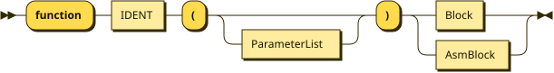

```
FunctionDefinition
         ::= 'function' IDENT '(' ParameterList? ')' ( Block | AsmBlock )
```

referenced by:

* Program

**ParameterList:**

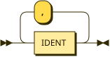

```
ParameterList
         ::= IDENT ( ',' IDENT )*
```

referenced by:

* FunctionDefinition

**Block:**

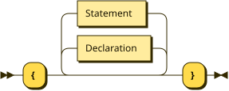

```
Block    ::= '{' ( Declaration | Statement )* '}'
```

referenced by:

* FunctionDefinition
* IfStatement
* Statement
* WhileStatement

**AsmBlock:**

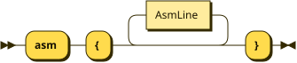

```
AsmBlock ::= 'asm' '{' AsmLine* '}'
```

referenced by:

* FunctionDefinition

**AsmLine:**

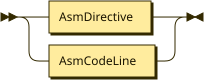

```
AsmLine  ::= AsmDirective
           | AsmCodeLine
```

referenced by:

* AsmBlock

**AsmDirective:**

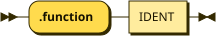

```
AsmDirective
         ::= '.function' IDENT
```

referenced by:

* AsmLine

**AsmCodeLine:**


```
AsmCodeLine
         ::= ( IDENT ':' )? Instruction? ASM_COMMENT?
```

referenced by:

* AsmLine

**Instruction:**

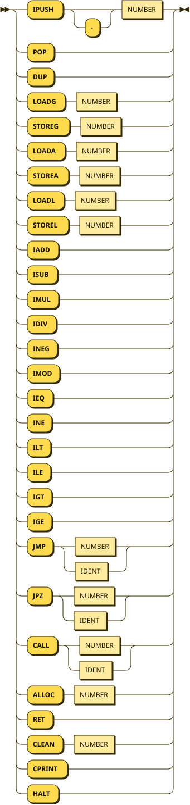

```
Instruction
         ::= 'IPUSH' '-'? NUMBER
           | 'POP'
           | 'DUP'
           | 'LOADG' NUMBER
           | 'STOREG' NUMBER
           | 'LOADA' NUMBER
           | 'STOREA' NUMBER
           | 'LOADL' NUMBER
           | 'STOREL' NUMBER
           | 'IADD'
           | 'ISUB'
           | 'IMUL'
           | 'IDIV'
           | 'INEG'
           | 'IMOD'
           | 'IEQ'
           | 'INE'
           | 'ILT'
           | 'ILE'
           | 'IGT'
           | 'IGE'
           | 'JMP' ( NUMBER | IDENT )
           | 'JPZ' ( NUMBER | IDENT )
           | 'CALL' ( NUMBER | IDENT )
           | 'ALLOC' NUMBER
           | 'RET'
           | 'CLEAN' NUMBER
           | 'CPRINT'
           | 'HALT'
```

referenced by:

* AsmCodeLine

**Declaration:**


```
Declaration
         ::= 'var' IDENT '=' Expression ';'
```

referenced by:

* Block

**Statement:**

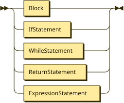

```
Statement
         ::= Block
           | IfStatement
           | WhileStatement
           | ReturnStatement
           | ExpressionStatement
```

referenced by:

* Block

**IfStatement:**

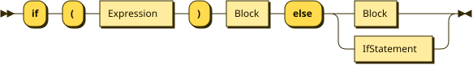

```
IfStatement
         ::= 'if' '(' Expression ')' Block 'else' ( Block | IfStatement )
```

referenced by:

* IfStatement
* Statement

**WhileStatement:**

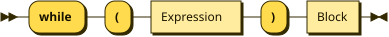

```
WhileStatement
         ::= 'while' '(' Expression ')' Block
```

referenced by:

* Statement

**ReturnStatement:**


```
ReturnStatement
         ::= 'return' Expression ';'
```

referenced by:

* Statement

**ExpressionStatement:**


```
ExpressionStatement
         ::= Expression ';'
```

referenced by:

* Statement

**Expression:**

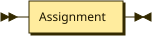

```
Expression
         ::= Assignment
```

referenced by:

* ArgumentList
* Declaration
* ExpressionStatement
* GlobalDeclaration
* IfStatement
* Primary
* ReturnStatement
* WhileStatement

**Assignment:**

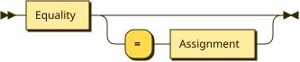

```
Assignment
         ::= Equality ( '=' Assignment )?
```

referenced by:

* Assignment
* Expression

**Equality:**

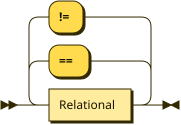

```
Equality ::= Relational ( ( '==' | '!=' ) Relational )*
```

referenced by:

* Assignment

**Relational:**

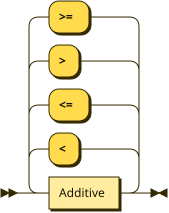

```
Relational
         ::= Additive ( ( '<' | '<=' | '>' | '>=' ) Additive )*
```

referenced by:

* Equality

**Additive:**

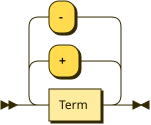

```
Additive ::= Term ( ( '+' | '-' ) Term )*
```

referenced by:

* Relational

**Term:**

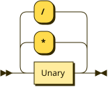

```
Term     ::= Unary ( ( '*' | '/' ) Unary )*
```

referenced by:

* Additive

**Unary:**

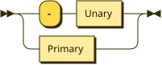

```
Unary    ::= '-' Unary
           | Primary
```

referenced by:

* Term
* Unary

**Primary:**

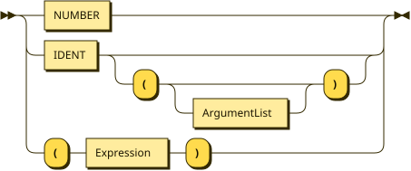

```
Primary  ::= NUMBER
           | IDENT ( '(' ArgumentList? ')' )?
           | '(' Expression ')'
```

referenced by:

* Unary

**ArgumentList:**

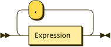

```
ArgumentList
         ::= Expression ( ',' Expression )*
```

referenced by:

* Primary

## 
 <sup>generated by [RR - Railroad Diagram Generator][RR]</sup>

[RR]: https://www.bottlecaps.de/rr/ui